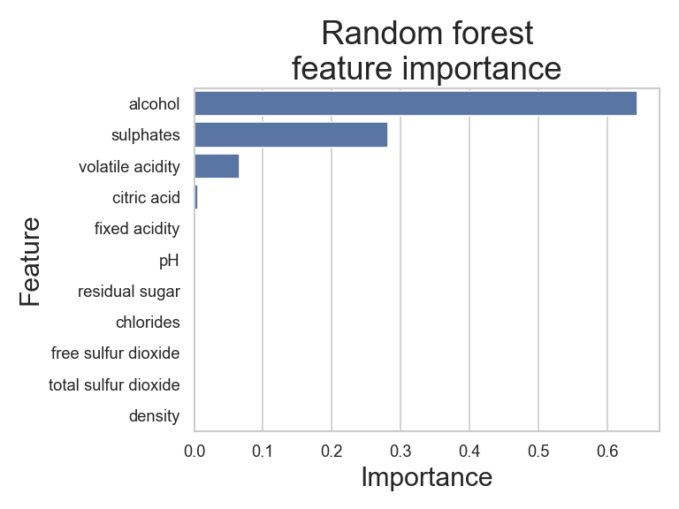
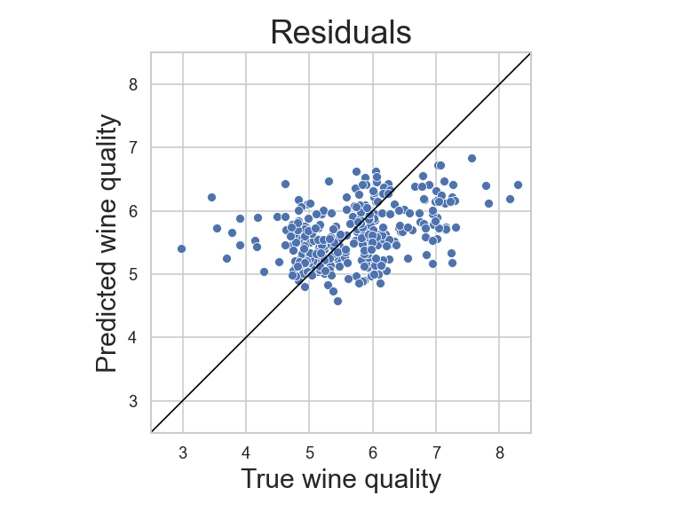

# 🍷 MLOps Wine Quality Prediction Project

## 📋 Project Overview

This project involves building and training a wine quality prediction model using a Random Forest Regressor. We analyze the wine dataset to identify important features and predict wine quality. The project also utilizes CML (Continuous Machine Learning) to automate and visualize the model's training and evaluation processes.

## 🎓 Sample Results

### Feature Importance


### Residuals Plot


## 🛠️ Technical Requirements

- Python 3.x
- Pandas
- Scikit-learn
- Matplotlib
- Seaborn
- CML for continuous integration and automated reporting

## ❗ Usage

1. Clone the repository and navigate to the project directory:
    ```bash
    git clone https://github.com/your-repo/MLOps_Train.git
    cd MLOps_Train
    ```

2. Install the required dependencies:
    ```bash
    pip install -r requirements.txt
    ```

3. Run the model training script:
    ```bash
    python train_model.py
    ```

   This will generate performance metrics and save plots in the `images` directory.

## 🔧 Optimal Workflow Configuration

### Data Preparation

- The dataset `wine_quality.csv` is loaded, and the target variable is separated from the features.
- A train-test split is performed with a test size of 20%.

### Model Training

- We use a **RandomForestRegressor** with a maximum depth of 2 and a random state for reproducibility.
- The model is trained on the training set, and scores are evaluated on both training and test sets.

### Feature Importance Visualization

- The script calculates feature importance values and creates a bar plot saved as `feature_importance.png` in the `images` folder.

### Residuals Plot

- We visualize the residuals by plotting the true vs. predicted values, saved as `residuals.png` in the `images` folder.

## ⚙️ CML Integration

The project leverages **CML (Continuous Machine Learning)** to automate model training and evaluation. Each commit triggers the CI pipeline, which runs the training script, evaluates the model, and uploads visual reports such as the feature importance and residuals plots. 

Ensure that the `.cml.yaml` configuration is set up properly for your environment.

## ⚠️ Known Limitations

- The model may not capture complex patterns due to the limited depth of the Random Forest.
- Performance may vary based on the quality and balance of the dataset.

## 📝 License

MIT License
